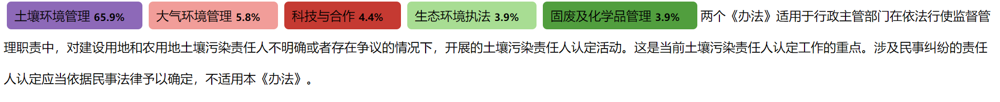

# envText

features：

1. :one:Support large-scale pre-training model in Chinese environmental field
**envBert**！

2. :two:Support large-scale pre-training **word2vec** in Chinese environmental field!

3. :three:Support Chinese environmental **vocabulary** with experts filtered!
4. :four: **All for domain tasks**：
   - Simplified the interface for the neural network model, and only retained the necessary batch_size, learning_rate and other parameters
  - I/O interfaces of huggingface transformers are further optimized to support more than 20 data set formats
  - One-click use model allows domain experts to focus on analytical problems
5. :five: Support easy custom models using transformers interface

If you find this project useful or helpful, please click star:star: in the upper right corner. Your support is the biggest motivation for our maintenance projects :metal:!


# Quick Start

## 1. install

python settings

```bash
pip install envtext
```


## 2. inference (without training)

Supported Pretrained Models:
```python
from envtext import Config
print(Config.pretrained_models)
```

| Task | backbone | model name | number of labels | description |
| ---- | ---- | ---- | ---- |  ---- |
| Masked language Model | env-bert | celtics1863/env-bert-chinese| --- | [link](https://huggingface.co/celtics1863/env-bert-chinese) | 
| news classification | env-bert | celtics1863/env-news-cls-bert | 8 labels | [link](https://huggingface.co/celtics1863/env-news-cls-bert)|
| paper classification | env-bert | celtics1863/env-news-cls-bert | 10 labels | [link](https://huggingface.co/celtics1863/env-news-cls-bert) |
| policy classification | env-bert | celtics1863/env-news-cls-bert | 15 labels | [link](https://huggingface.co/celtics1863/env-news-cls-bert) |
| topic classification | env-bert | celtics1863/env-topic | 63 labels | [link](https://huggingface.co/celtics1863/env-topic) |
| Part-of-speech | env-bert | celtics1863/pos-bert | 41 labels | [link](https://huggingface.co/celtics1863/pos-bert) |
| Masked language Model | env-albert | celtics1863/env-albert-chinese| --- | [link](https://huggingface.co/celtics1863/env-albert-chinese) |
| news classification | env-albert | celtics1863/env-news-cls-albert | 8 labels | [link](https://huggingface.co/celtics1863/env-news-cls-albert) |
| paper classification | env-albert | celtics1863/env-paper-cls-albert | 10 labels | [link](https://huggingface.co/celtics1863/env-paper-cls-albert) |
| policy classification | env-albert | celtics1863/env-policy-cls-albert | 15 labels | [link](https://huggingface.co/celtics1863/env-policy-cls-albert) |
| topic classification | env-albert | celtics1863/env-topic | 63 labels | [link](https://huggingface.co/celtics1863/env-topic-albert) |
| Part-of-speech | env-albert | celtics1863/pos-ner-albert | 41 labels | [link](https://huggingface.co/celtics1863/pos-ner-albert) |
| word2vec | word2vec | word2vec | ---- | [link](https://links.jianshu.com/go?to=https%3A%2F%2Farxiv.org%2Fabs%2F1301.3781v3) |
| word2vec | env-bert | bert2vec | ---- | [link](https://huggingface.co/celtics1863/env-bert-chinese) |


#### 2.1 topic classification
```python
from envtext import AlbertCLS,Config
model = AlbertCLS(Config.albert.topic_cls)
model("在全球气候大会上，气候变化是各国政府都关心的话题")
```
<!--  -->


#### 2.2 news classification

```python
from envtext import AlbertCLS,Config
model = AlbertCLS(Config.albert.news_cls)
model("清洁能源基地建设对国家能源安全具有战略支撑作用。打造高质量的清洁能源基地的同时，也面临着一系列挑战，比如如何持续降低光储系统的度电成本、如何通过数字化的手段进一步提升运营与运维效率，如何更有效地提升光储系统的安全防护水平、如何在高比例新能源条件下实现稳定并网与消纳等。")
```

<!--  -->


#### 2.3 policy classification

```python
from envtext import AlbertCLS,Config
model = AlbertCLS(Config.albert.news_cls)
model("两个《办法》适用于行政主管部门在依法行使监督管理职责中，对建设用地和农用地土壤污染责任人不明确或者存在争议的情况下，开展的土壤污染责任人认定活动。这是当前土壤污染责任人认定工作的重点。涉及民事纠纷的责任人认定应当依据民事法律予以确定，不适用本《办法》。")
```
<!--  -->



#### 2.4 part-of-speech recognition

```python
from envtext import AlbertNER,Config
model = AlbertNER(Config.albert.pos_ner)
model("在全球气候大会上，气候变化是各国政府都关心的话题")
```
<!--  -->


#### 2.5 word2vec

```python
from envtext.models import load_word2vec
model = load_word2vec()
model.most_similar('环境保护')
```
results:
```bash
[('环保', 0.8425659537315369),
 ('生态环境保护', 0.7966809868812561),
 ('土壤环境保护', 0.7429764270782471),
 ('环境污染防治', 0.7383896708488464),
 ('生态保护', 0.6929160952568054),
 ('大气环境保护', 0.6914916634559631),
 ('应对气候变化', 0.6642681956291199),
 ('水污染防治', 0.6642411947250366),
 ('大气污染防治', 0.6606612801551819),
 ('环境管理', 0.6518533825874329)]
```


## 3. Training and Inference

With envtext, you can label some samples, train your model, and further use the model to deduce the rest of the text.

Currently Supported Model：

| Taskname | Bert models |Albert models | RNNs models | Others |
| ------ | ------ | ------ | ------ | ----- | 
| Filling Mask | BertMLM  | ------  |  ------  | ----- |
| classification   | BertCLS | AlbertCLS |   RNNCLS  |  ------  |
| Sentimental Analysis | BertSA  |  ----    |  RNNSA  |  ------  |
| MultiChoice   |BertMultiChoice | ----  | RNNMultiChoice | ----- |
| Namely Entity Recognition | BertNER  | AlbertNER   | RNNNER  | -----    |
| Nested Namely Entity Recognition | BertGP  | -----   | RNNNER  | -----    |
| relation classification  | BertRelation  | ----   | ----  | -----    |
| entity-relation joint extraction | BertTriple  | ----   | ----  | -----    |
| Word2Vec  |  Bert2vec  |  -----   |----- | Word2Vec |

In addition to text generation tasks, the basic support for most of the NLP tasks.

Bert and Albert supports large-scale pre-trained model `envBert` and `envalbert` in the environment texts, as well as other Bert models in huggingface transformer.

The RNNs model consists of `LSTM`, `GRU`, and `RNN`, which can be initialized with word vectors that are pre-trained in the environment domain or initialized with Onehot coding.


### 3.1 Training

##### 3.1 Bert or Albert Model training

```python
#Import bert model(eg. classification model)
from envtext.models import BertCLS
model = BertCLS('celtics1863/env-bert-chinese')

# # use self-defined datasets
# model.load_dataset(file_path,task = 'cls',format = 'datasets-format')
# # use default datasets in envtext
model.load_dataset('isclimate')

#model training
model.train()

#model saving
model.save_model('classification') #input directory
```

##### 3.2 RNN training

```python
#Import rnn model(eg. classification model)
from envtext.models import RNNCLS
model = RNNCLS()

# # use self-defined datasets
# model.load_dataset(file_path,task = 'cls',format = 'datasets-format')
# # use default datasets in envtext
model.load_dataset('isclimate')

#model training
model.train()

#model saving
model.save_model('classification') #输入待保存的文件夹
```


### 3.2 Inference with own model

#### 3.2.1 Inference with own bert model
```python
#import trained models(eg. masked language model)
from envtext.models import BertMLM
model = BertMLM('celtics1863/env-bert-chinese')

#predict
model('[MASK][MASK][MASK][MASK]是各国政府都关心的话题')

#导出结果
model.save_result('result.csv')
```
#### 3.2.2 Inference with own rnn model

from `directory` with `pytorch_model.bin` import model

```python
from envtext.models import RNNCLS

model = RNNCLS('local directory')

#predict
model('气候变化是各国政府都关心的话题')

#save result
model.save_result('result.csv')
```


### 4. self-defined model

##### 4.1 self-defined bert model

First define a regressor bert model

```python
from envtext.models.bert_base import BertBase
import torch
from transformers import BertPreTrainedModel,BertModel

class MyBert(BertPreTrainedModel):
    def __init__(self, config):
        super(MyBert, self).__init__(config)
        self.bert = BertModel(config) #bert model
        self.regressor = torch.nn.Linear(config.hidden_size, 1) #regressor
        self.loss = torch.nn.MSELoss() #loss function
        
    def forward(self, input_ids, token_type_ids=None, attention_mask=None, labels=None,
              position_ids=None, inputs_embeds=None, head_mask=None):
        outputs = self.bert(input_ids,
                            attention_mask=attention_mask,
                            token_type_ids=token_type_ids,
                            position_ids=position_ids,
                            head_mask=head_mask,
                            inputs_embeds=inputs_embeds)
        #use[CLS] token
        cls_output = outputs[0][:,0,:] 

        #get logits 
        logits = self.regressor(cls_output)

        outputs = (logits,)
        
        #Here needs to be consistent with bert's interface, return (loss,logits) if there are labels input, otherwise return (logits,)
        if labels is not None: 
            loss = self.loss(logits.squeeze(),labels)
            outputs = (loss,) + outputs
        return outputs

```
Interface the model with envtext

```python
class MyBertModel(BertBase):
    #Rewrite the initialization function
    def initialize_bert(self,path = None,config = None,**kwargs):
        super().initialize_bert(path,config,**kwargs)
        self.model = MyBert.from_pretrained(self.model_path)

    #[Optional] rewrite the function that pre-process the prediction result
    def preprocess(self,text, logits, **kwargs):     
        text = text.replace("\n", "")
        return text

    #[Optional] rewrite the function that postprocesses the prediction result
    def postprocess(self,text, logits, **kwargs):      
        logits = logits.squeeze()
        return logits.tolist()
            
     #[Optional] recalculated discriminant function to provide metrics information other than loss during training
     def compute_metrics(eval_pred)
         from envtext.utils.metrics import metrics_for_reg
         return metrics_for_reg(eval_pred)
     
     #[Optional] Optional to align parameters in config,
     #Because there are times when you need to accept multiple inputs, such as the number of categories or a list of categories when classifying tasks, you can use this interface for alignment.
     def align_config(self):
         super().align_config()
         ##可以使用self.update_config() 或 self.set_attribute() 接口重新设置config
         pass
```

##### 4.2 self-defined RNN model

Defining the RNN model is similar.
Firstly, an LSTM classification model is implemented as follows:

```python
from torch import nn
import torch
class MyRNN(nn.Module):
    def __init__(self,config):
        self.rnn = nn.LSTM(config.embed_size, config.hidden_size ,config.num_layers,batch_first = True)
        self.classifier = nn.Linear(config.hidden_size,config.num_labels)
    
    def forward(self,X,labels = None):
        X,_ = self.rnn(X)
        logits = self.classifier(X)
        
        #Align interfaces, still need to output with labels present (loss,logits) and without labels (logits,)
        if labels is not None:
            loss = self.loss_fn(logits,labels)
            return (loss,logits) 
        return (logits,)
```
Then interface the model with the envtext interface,

```python
import numpy as np
class MyRNNModel(BertBase):
    #Rewrite the initialization function
    def initialize_bert(self,path = None,config = None,**kwargs):
        super().initialize_bert(path,config,**kwargs) #保持不变
        self.model = MyRNN.from_pretrained(self.model_path) 

    #[Optional] rewrite the function that postprocesses the prediction result
    def postprocess(self,text, logits, print_result = True ,save_result = True):     
        pred = np.argmax(logits,axis = -1)
        return pred.tolist()
            
    #[Optional] rewrite metrics，add metric besides loss, for training
    def compute_metrics(eval_pred):
        return {} #返回一个dict
        
    #[Optional] rewrite align_config
    #Because there are times when you need to accept multiple inputs, such as the number of categories or a list of categories when classifying tasks, you can use this interface for alignment.
    def align_config(self):
        super().align_config()
```

For more detailed tutorials, cases will be added in [jupyter notebooks]('notebooks')

### 5. Some tricks

1. Bert model is relatively large. If only cpu is used, it is recommended to first use RNN model to run out a result, and then consider whether to use Bert model after observing whether the quantity/quality of data set is up to standard. Generally, envbert model is about 10 points ahead of RNN model, especially when the data set is smaller, the advantage of envbert is more obvious.

2. The neural network model is affected by the initial weight, and the situation of each training is different. It is recommended to run several times to get the best result.

3. Learning rate, Epoch, and Batchsize are the three most critical hyperparameters, which should be carefully adjusted for different data sets. The default parameter can achieve a better value in most cases, but it will not achieve the best result.

# LISENCE
Apache Lisence 2.0


