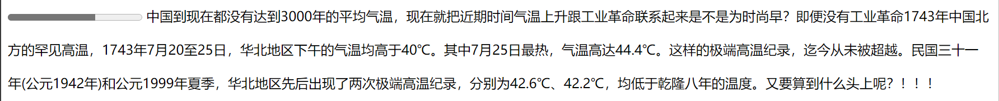
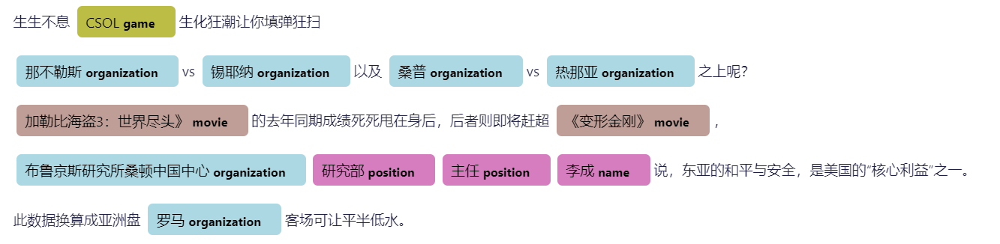

# envText

[English](README-en.md)


**首款**中文环境领域文本分析工具。

特性：  
1. :one:支持中文环境领域大规模预训练模型**envBert**！

2. :two:支持中文环境领域大规模预训练**词向量**!

3. :three:支持中文环境领域专家过滤的**词表**!

4. :four: **一且设计均为领域专家研究服务**：
    - 为神经网络模型精简了接口，只保留了必要的batch_size, learning_rate等参数
    - 进一步优化huggingface transformers输入输出接口，支持20余种数据集格式
    - 一键使用模型，让领域专家精力集中在分析问题上

5. :five: 使用transformers接口，支持轻松自定义模型


如果您觉得本项目有用或是有帮助到您，麻烦您点击一下右上角的star :star:。您的支持是我们维护项目的最大动力:metal:！


# 快速开始

## 1. 安装


```bash
pip install envtext
```


## 2. 推理 (without training)

支持的预训练模型
```python
from envtext import Config
print(Config.pretrained_models)
```

| Task | backbone | model name | number of labels | description |
| ---- | ---- | ---- | ---- |  ---- |
| 掩码语言模型 | env-bert | celtics1863/env-bert-chinese| --- | [link](https://huggingface.co/celtics1863/env-bert-chinese) | 
| 新闻分类 | env-bert | celtics1863/env-news-cls-bert | 8 类别 | [link](https://huggingface.co/celtics1863/env-news-cls-bert)|
| 论文分类 | env-bert | celtics1863/env-news-cls-bert | 10类别 | [link](https://huggingface.co/celtics1863/env-news-cls-bert) |
| 政策分类 | env-bert | celtics1863/env-news-cls-bert | 15 类别 | [link](https://huggingface.co/celtics1863/env-news-cls-bert) |
| 话题分类 | env-bert | celtics1863/env-topic | 63 类别 | [link](https://huggingface.co/celtics1863/env-topic) |
| 词性/实体/术语识别 | env-bert | celtics1863/pos-bert | 41 类别 | [link](https://huggingface.co/celtics1863/pos-bert) |
| 掩码语言模型 | env-albert | celtics1863/env-albert-chinese| --- | [link](https://huggingface.co/celtics1863/env-albert-chinese) |
| 新闻分类 | env-albert | celtics1863/env-news-cls-albert | 8 类别 | [link](https://huggingface.co/celtics1863/env-news-cls-albert) |
| 论文分类 | env-albert | celtics1863/env-paper-cls-albert | 10 类别 | [link](https://huggingface.co/celtics1863/env-paper-cls-albert) |
| 政策分类 | env-albert | celtics1863/env-policy-cls-albert | 15 类别 | [link](https://huggingface.co/celtics1863/env-policy-cls-albert) |
| 话题分类 | env-albert | celtics1863/env-topic | 63 类别 | [link](https://huggingface.co/celtics1863/env-topic-albert) |
| 词性/实体/术语识别 | env-albert | celtics1863/pos-ner-albert | 41 类别 | [link](https://huggingface.co/celtics1863/pos-ner-albert) |
| 词向量 | word2vec | word2vec | ---- | [link](https://links.jianshu.com/go?to=https%3A%2F%2Farxiv.org%2Fabs%2F1301.3781v3) |
| 词向量 | env-bert | bert2vec | ---- | [link](https://huggingface.co/celtics1863/env-bert-chinese) |


#### 2.1 环境话题分类
```python
from envtext import AlbertCLS,Config
model = AlbertCLS(Config.albert.topic_cls)
model("在全球气候大会上，气候变化是各国政府都关心的话题")
```
<!--  -->


#### 2.2 环境新闻分类

```python
from envtext import AlbertCLS,Config
model = AlbertCLS(Config.albert.news_cls)
model("清洁能源基地建设对国家能源安全具有战略支撑作用。打造高质量的清洁能源基地的同时，也面临着一系列挑战，比如如何持续降低光储系统的度电成本、如何通过数字化的手段进一步提升运营与运维效率，如何更有效地提升光储系统的安全防护水平、如何在高比例新能源条件下实现稳定并网与消纳等。")
```

<!--  -->


#### 2.3 环境政策分类

```python
from envtext import AlbertCLS,Config
model = AlbertCLS(Config.albert.news_cls)
model("两个《办法》适用于行政主管部门在依法行使监督管理职责中，对建设用地和农用地土壤污染责任人不明确或者存在争议的情况下，开展的土壤污染责任人认定活动。这是当前土壤污染责任人认定工作的重点。涉及民事纠纷的责任人认定应当依据民事法律予以确定，不适用本《办法》。")
```
<!--  -->


#### 2.4 环境术语/实体/词性识别

```python
from envtext import AlbertNER,Config
model = AlbertNER(Config.albert.pos_ner)
model("在全球气候大会上，气候变化是各国政府都关心的话题")
```
<!--  -->


#### 2.5 word2vec词向量

导入模型
```python
from envtext.models import load_word2vec
model = load_word2vec()
```

获得向量：
```python
model.get_vector('环境保护')
```
results:
```bash
array([-13.304651  ,  -3.1560812 ,   6.4074125 ,  -3.6906316 ,
        -1.4232658 ,   4.7912726 ,  -0.8003967 ,   4.0756955 ,
        -2.7932549 ,   4.029449  ,  -1.9410586 ,  -6.844793  ,
        -8.859059  ,  -0.93295586,   6.1359916 ,   1.9588425 ,
         2.625194  ,  -4.3848248 ,  -6.4393744 ,   6.0373173 ,
        -6.155831  ,  -6.4436955 ,   5.107795  , -11.209849  ,
         0.04123919,   1.286314  , -11.320914  ,  -6.475419  ,
         0.8528328 ,  -6.1932034 ,   2.0541244 ,  -3.3850324 ,
         4.284287  ,  -7.197888  ,  -2.6205683 ,   0.31572345,
         5.227246  ,   3.903521  ,  -2.5171268 ,   2.4655945 ,
        -5.5421305 ,   5.5044537 ,   6.984615  ,  -7.6862364 ,
         0.87583727,   0.03240405,   2.3616972 ,  -0.9396556 ,
         3.9617348 ,   0.6690969 , -10.708663  ,  -2.8534212 ,
        -0.8638448 ,  12.048176  ,   5.5968127 ,  -6.834452  ,
         6.9515004 ,   3.948555  ,  -4.527055  ,   4.389503  ,
        -0.47533572,   6.79178   ,  -0.8689579 ,  -2.7712438 ],
      dtype=float32)
```

计算相似度
```python
model.most_similar('环境保护')
```
results:
```bash
[('环保', 0.8425659537315369),
 ('生态环境保护', 0.7966809868812561),
 ('土壤环境保护', 0.7429764270782471),
 ('环境污染防治', 0.7383896708488464),
 ('生态保护', 0.6929160952568054),
 ('大气环境保护', 0.6914916634559631),
 ('应对气候变化', 0.6642681956291199),
 ('水污染防治', 0.6642411947250366),
 ('大气污染防治', 0.6606612801551819),
 ('环境管理', 0.6518533825874329)]
```

#### 2.6 env-bert词向量

导入模型：
```python
from envtext import Bert2Vec,Config
model = Bert2Vec(Config.bert.bert_mlm)
```
获取向量：
```python
#获得词向量
model.get_vector('环境保护')
#获得句向量，输入已经被分好词的句子
model.get_vector(["环境保护","人人有责"])
```
结果：
```
array([ 1.4521e+00, -3.4131e-01,  6.8420e-02, -6.1371e-02,  2.9004e-01,
        1.8872e-01, -4.0405e-01,  4.1138e-01, -5.0000e-01,  5.2344e-01,
        5.9814e-01, -3.1396e-01,  3.0029e-01,  3.2959e-02,  1.6553e+00,
       -4.4800e-01,  1.0195e+00, -6.4697e-01,  3.0200e-01,  5.7080e-01,
        7.6599e-02,  3.4155e-01,  1.2805e-01, -2.1863e-01, -3.3398e-01,
        6.9092e-01,  4.2725e-01, -4.8364e-01,  7.8760e-01,  3.8940e-01,
        4.9927e-02, -7.1106e-02, -5.3271e-01, -4.8486e-01,  3.1665e-01,
        5.1367e-01,  8.8477e-01, -2.2302e-01,  1.9943e-02,  7.3047e-01,
       -1.5417e-01, -1.4206e-02, -5.2881e-01,  4.0674e-01,  2.7466e-01,
       -1.3940e-01,  5.2490e-01, -1.1514e+00, -4.2676e-01,  9.5508e-01,
       ...])
```

计算相似度
```python
model.add_words(
    [
        "环境污染",
        "水污染",
        "大气污染",
        "北京市",
        "上海市",
        "兰州市"
    ])
model.most_similar("郑州市")
```
results:
```bash
[('兰州市', 0.8755860328674316),
 ('北京市', 0.7335232496261597),
 ('上海市', 0.7241109013557434),
 ('大气污染', 0.471857488155365),
 ('水污染', 0.4557272493839264)]
```

#### 2.7 完型填空

用`[MASK]`标记需要填的部分
```
from envtext import  BertMLM,Config
model = BertMLM(Config.bert_mlm)
model("在全球气候大会上，[MASK][MASK][MASK][MASK]是各国政府都关心的话题")
```
results：
```bash
text:在全球气候大会上，[MASK][MASK][MASK][MASK]是各国政府都关心的话题 
  predict: ['气', '体', '减', '少'] ; probability: 0.5166 
  predict: ['气', '体', '减', '排'] ; probability: 0.5166 
  predict: ['气', '体', '减', '碳'] ; probability: 0.5166 
  predict: ['气', '体', '减', '缓'] ; probability: 0.5166 
  predict: ['气', '体', '减', '量'] ; probability: 0.5166 
```


#### 2.8 情感分析

预测情感激烈程度
```
from envtext import  BertSA,Config
model = BertMLM(Config.intensity_sa)
model("中国到现在都没有达到3000年的平均气温，现在就把近期时间气温上升跟工业革命联系起来是不是为时尚早？即便没有工业革命1743年中国北方的罕见高温，1743年7月20至25日，华北地区下午的气温均高于40℃。其中7月25日最热，气温高达44.4℃。这样的极端高温纪录，迄今从未被超越。民国三十一年(公元1942年)和公元1999年夏季，华北地区先后出现了两次极端高温纪录，分别为42.6℃、42.2℃，均低于乾隆八年的温度。又要算到什么头上呢？！！！")
```
results：



#### 2.9 实体抽取

使用cluener上训练的模型
```
from envtext import  BertNER,Config
model = BertNER(Config.bert.clue_ner)
model([
"生生不息CSOL生化狂潮让你填弹狂扫",
"那不勒斯vs锡耶纳以及桑普vs热那亚之上呢？",
"加勒比海盗3：世界尽头》的去年同期成绩死死甩在身后，后者则即将赶超《变形金刚》，",
"布鲁京斯研究所桑顿中国中心研究部主任李成说，东亚的和平与安全，是美国的“核心利益”之一。",
"此数据换算成亚洲盘罗马客场可让平半低水。",
],print_result=True)
```
results：



## 3. 训练并推理

使用envtext，您可以标记一些示例，训练您的模型，并进一步使用模型来推断其余的文本。

目前支持的模型：

| Taskname | Bert models |Albert models | RNNs models | Others |
| ------ | ------ | ------ | ------ | ----- | 
| 完型填空 | BertMLM  | ------  |  ------  | ----- |
| 分类   | BertCLS | AlbertCLS |   RNNCLS  |  CNNCLS,TFIDFCLS  |
| 情感分析 | BertSA  |  ----    |  RNNSA  |  ------  |
| 多选   |BertMultiChoice | AlbertMultiChoice  | RNNMultiChoice | ----- |
| 命名实体识别 | BertNER  | AlbertNER   | RNNNER  | -----    |
| 嵌套命名实体识别 | BertGP  | -----   | -----  | -----    |
| 关系分类  | BertRelation  | ----   | ----  | -----    |
| 实体关系联合抽取 | BertTriple  | ----   | ----  | -----    |
| 词向量  |  Bert2vec  |  -----   |----- | Word2Vec |

除了文本生成任务外，基本支持大部分的NLP任务。

Bert and Albert支持环境文本中的大规模预训练模型' envBert '和' envalbert '，以及huggingface transformer中的其他Bert模型。

RNN模型由“LSTM”、“GRU”和“RNN”组成，可以用环境域预训练的词向量进行初始化，也可以用Onehot编码进行初始化。

### 3.1 训练

##### 3.1 Bert/albert 模型训练

```python
#导入bert模型(eg. 分类模型)
from envtext.models import BertCLS
model = BertCLS('celtics1863/env-bert-chinese')

# # 如果使用自定义的数据集
# model.load_dataset(file_path,task = 'cls',format = 'datasets-format')
# # 使用envtext中默认的数据集
model.load_dataset('isclimate')

#模型训练
model.train()

#模型保存
model.save_model('classification') #input directory
```

##### 3.2 RNN training

```python
#导入 rnn model(eg. 分类模型)
from envtext.models import RNNCLS
model = RNNCLS()

# # 使用自定义的模型
# model.load_dataset(file_path,task = 'cls',format = 'datasets-format')
# # 使用EnvText自带的数据集
model.load_dataset('isclimate')

#模型训练
model.train()

#保存模型
model.save_model('classification') #输入待保存的文件夹
```


### 3.2 使用自定义的模型推理

#### 3.2.1 使用自定义bert模型推理
```python
#从文件夹导入莫小仙
from envtext.models import BertMLM
model = BertMLM('celtics1863/env-bert-chinese')

#预测结果，可以输入 str 或 List[str]
model('[MASK][MASK][MASK][MASK]是各国政府都关心的话题')

#导出结果
model.save_result('result.csv')
```
#### 3.2.2 使用RNN模型推理

从 含有`pytorch_model.bin`的`文件` 推理

```python
from envtext.models import RNNCLS

model = RNNCLS('local directory')

#predict
model('气候变化是各国政府都关心的话题')

#save result
model.save_result('result.csv')
```


### 4. 自定义模型

##### 4.1 自定义bert模型

从bert模型定义一个回归器

```python
from envtext.models.bert_base import BertBase
import torch
from transformers import BertPreTrainedModel,BertModel

class MyBert(BertPreTrainedModel):
    def __init__(self, config):
        super(MyBert, self).__init__(config)
        self.bert = BertModel(config) #bert model
        self.regressor = torch.nn.Linear(config.hidden_size, 1) #regressor
        self.loss = torch.nn.MSELoss() #loss function
        
    def forward(self, input_ids, token_type_ids=None, attention_mask=None, labels=None,
              position_ids=None, inputs_embeds=None, head_mask=None):
        outputs = self.bert(input_ids,
                            attention_mask=attention_mask,
                            token_type_ids=token_type_ids,
                            position_ids=position_ids,
                            head_mask=head_mask,
                            inputs_embeds=inputs_embeds)
        #use[CLS] token
        cls_output = outputs[0][:,0,:] 

        #get logits 
        logits = self.regressor(cls_output)

        outputs = (logits,)
        
        #这里需要与bert的接口保持一致
        if labels is not None: 
            loss = self.loss(logits.squeeze(),labels)
            outputs = (loss,) + outputs
        return outputs

```
对齐EnvText的接口：

```python
class MyBertModel(BertBase):
    #Rewrite the initialization function
    def initialize_bert(self,path = None,config = None,**kwargs):
        super().initialize_bert(path,config,**kwargs)
        self.model = MyBert.from_pretrained(self.model_path)

    #[Optional] 重写预处理函数
    def preprocess(self,text, logits, **kwargs):     
        text = text.replace("\n", "")
        return text

    #[Optional] 重写后处理函数
    def postprocess(self,text, logits, **kwargs):      
        logits = logits.squeeze()
        return logits.tolist()
            
     #[Optional] 在训练时会调用，计算除loss以外的metric
     def compute_metrics(eval_pred)
         from envtext.utils.metrics import metrics_for_reg
         return metrics_for_reg(eval_pred)
     
     #[Optional] Optional to align parameters in config,
     #对齐参数配置
     def align_config(self):
         super().align_config()
         ##可以使用self.update_config() 或 self.set_attribute() 接口重新设置config
         pass
```

##### 4.2 self-defined RNN model

RNN模型的定义与此类似。  

首先，实现LSTM分类模型，具体如下:

```python
from torch import nn
import torch
class MyRNN(nn.Module):
    def __init__(self,config):
        self.rnn = nn.LSTM(config.embed_size, config.hidden_size ,config.num_layers,batch_first = True)
        self.classifier = nn.Linear(config.hidden_size,config.num_labels)
    
    def forward(self,X,labels = None):
        X,_ = self.rnn(X)
        logits = self.classifier(X)
        
        #Align interfaces, still need to output with labels present (loss,logits) and without labels (logits,)
        if labels is not None:
            loss = self.loss_fn(logits,labels)
            return (loss,logits) 
        return (logits,)
```
对齐EnvText的接口

```python
import numpy as np
class MyRNNModel(BertBase):
    #Rewrite the initialization function
    def initialize_bert(self,path = None,config = None,**kwargs):
        super().initialize_bert(path,config,**kwargs) #保持不变
        self.model = MyRNN.from_pretrained(self.model_path) 

    #[Optional] rewrite the function that postprocesses the prediction result
    def postprocess(self,text, logits, print_result = True ,save_result = True):     
        pred = np.argmax(logits,axis = -1)
        return pred.tolist()
            
    #[Optional] rewrite metrics，add metric besides loss, for training
    def compute_metrics(eval_pred):
        return {} #返回一个dict
        
    #[Optional] rewrite align_config
    #Because there are times when you need to accept multiple inputs, such as the number of categories or a list of categories when classifying tasks, you can use this interface for alignment.
    def align_config(self):
        super().align_config()
```

对于更详细的教程，案例将添加在[jupyter notebooks]('notebooks')


### 5. 使用建议

1. Bert模型比较大，如果只有cpu的情况下，建议先用RNN模型，跑出一个结果，观察数据集的数量/质量是否达标，再考虑是否用Bert模型。一般envbert模型要比RNN模型领先10个点左右，尤其在数据集越小的情况下，envbert的优势越明显。
2. 神经网络模型受到初始化权重影响，每一次训练的情况不一样，建议多跑几次，取最好的结果。
3. Learning rate, Epoch, Batchsize是三个最关键的超参数，需要对不同数据集小心调整。默认的参数可以在大多数情况下达到较优的值，但是一定不会达到最好的结果。

# LISENCE
Apache Lisence


